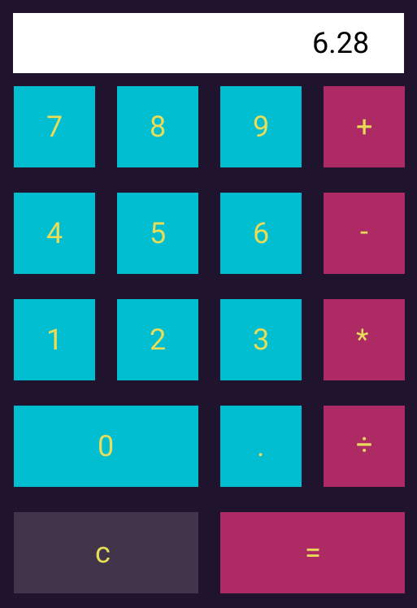
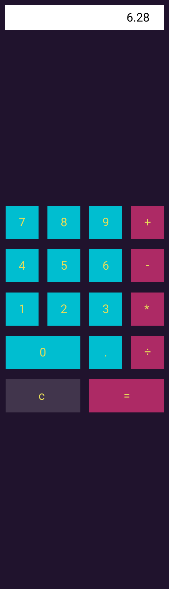
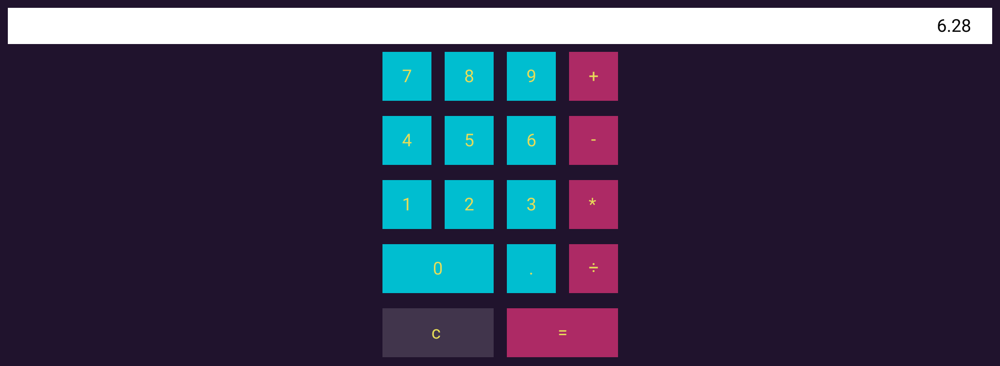
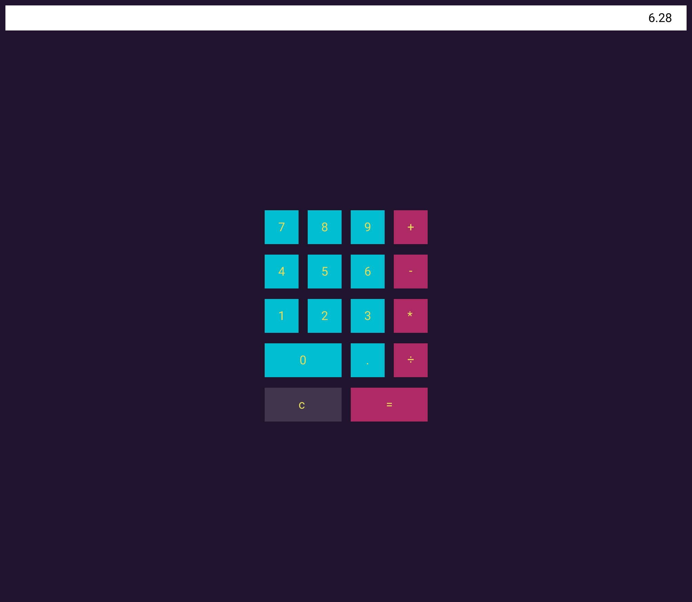

# Mission Possible : Calculator

Your mission, should you choose to accept it, is to create a simple [4-Function Calculator](https://www.basic-mathematics.com/four-function-calculator.html) Application.

There are a [number](https://www.desmos.com/fourfunction) [of](https://www.theonlinecalculator.com/) [examples](https://calculator-1.com/) of these online, but the one you'll be making won't be quite *as* complex.
 
Simple enough right? Wrong! Oh, wait... I'm thinking about something else...Right!

## Getting Started

From within this repository:

Install with: 

```bash
npm install
```

Serve application in **app/** folder with:

```bash
npm start
```

## Implementation Details

You will be implementing a calculator.



https://www.figma.com/file/e2MD88PqGgCtlIKBcJNaVa/Mission-Calculator?node-id=0%3A1

You will be implementing a calculator.

You may use the structure of this repository and this readme as a guide, but do not feel constrained. Use any methods that you wish.

Target google chrome browser.

Ask me questions.

Search the web for answers.

Channel your inner programmer.

Exact spacing isn't too important.

### Re-sizing Details

When resizing the screen vertically, the Display Box stays at the top of the screen and maintains a constant height. The collection of buttons remains centered -- the space between it and the bottom of the screen equal to the space between it and the Display Box.


➽➽➽


When resizing the screen horizontally, the Display Box widens while maintaining constant space above and to the side. The collection of buttons remains centered -- the space being equal on its sides.


➽➽➽


Combined:

 
➽➽➽


### Functional Details

#### Display Box

The user cannot edit the display box. Its content only changes as a result of clicking buttons.

#### Number Buttons: ".", "0", "1", "2", "3", "4", "5", "6", "7", "8", "9"

Clicking one of the Number Buttons adds a symbol to the number box.

If you click on a number button immediately after clicking an Operation Button (see below), a new number will be created.

Note: Leading "0"s are Okay, ("0009"), but clicking "." should put at most a single decimal point into the box. (".9", "00.09" are both possible, but "0.0.9" is not).

#### Operation Buttons: "+", "-", "*", "÷", "="

Clicking one of the Operation Buttons applies a stored operation to the displayed number as well as a stored number. If the button is not the "=" button, the corresponding operation is stored for future use.

This less intuitive to describe than to actually see for your self. It might be easier to type it out:

1. Click "4"
    ("4" is displayed)
2. Click "+"
    (the number 4 as well as "addition" are stored somewhere. "4" is still displayed)
3. Click "3"
    ("4" is replaced with "3" is displayed)
4. Click "7"
    ("37" is displayed)
5. Click "-"
  (we have the 4 stored as well as "addition", so we combine those with 37 to get (4 + 37 =) 41. We then replace 4 with 41 and "addition" with "subtraction". "41" is displayed.)
6. Click "2"
    ("2" is displayed)
7. Click "="
    (we have the 41 stored as well as "subtraction", so we combine those with 2 to get (41 - 2 =) 39. We then replace 41 with 39 and because we used the "=" we don't store an operation. "39" is displayed.)

(Note: This above suggest implementing "=" like the other "operations". This *may* not the best choice.).

##### Clear Button: "c"

This deletes the any stored numbers and any stored operations, as well as clears the Display Box.

## Grading

Grades aer based on two factors: your effort and my effort. Since I'm feeling lazy, you pass! 

We will use this exercise to determine what we know *and* what we would like to know. We will use this to decide the trajectory of coding academy going forward.

## Stretch Goals

- Create a negative number button.
- Prevent leading zeros  (e.g. "0009"),
- Add a glow around the button corresponding to the stored operation.
- Make it respond to keypresses (without allowing the user to type into the box).
- Make it talk.